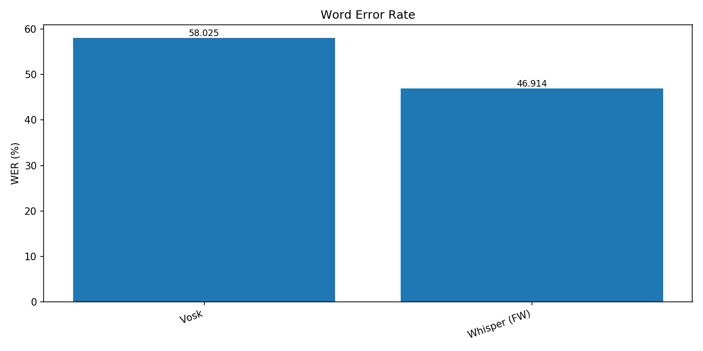
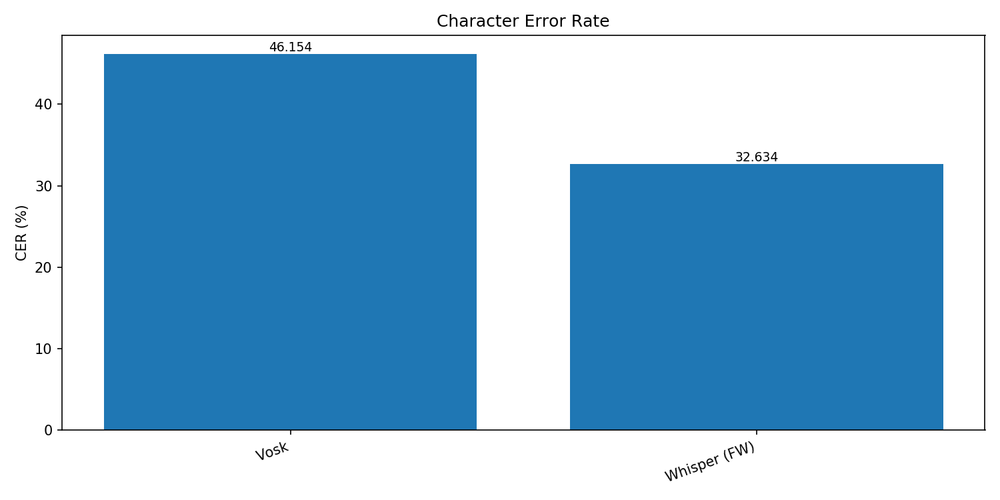
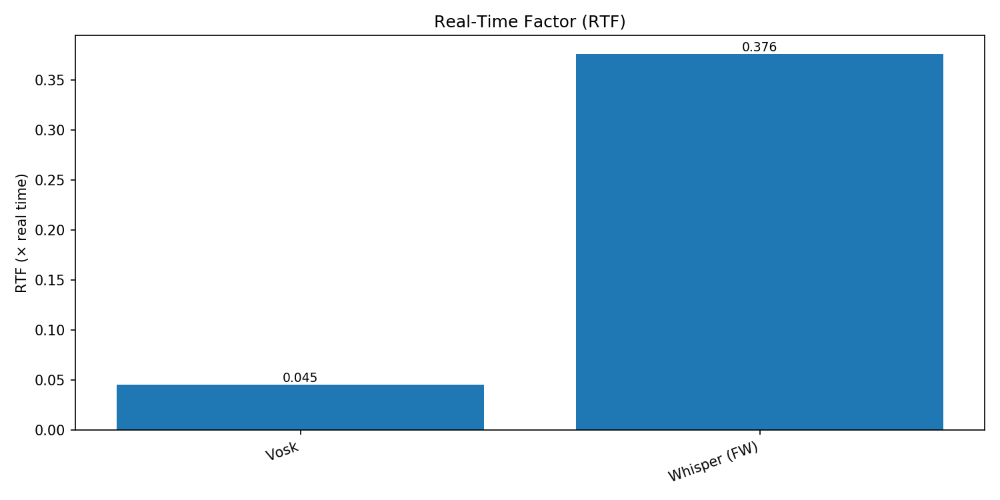
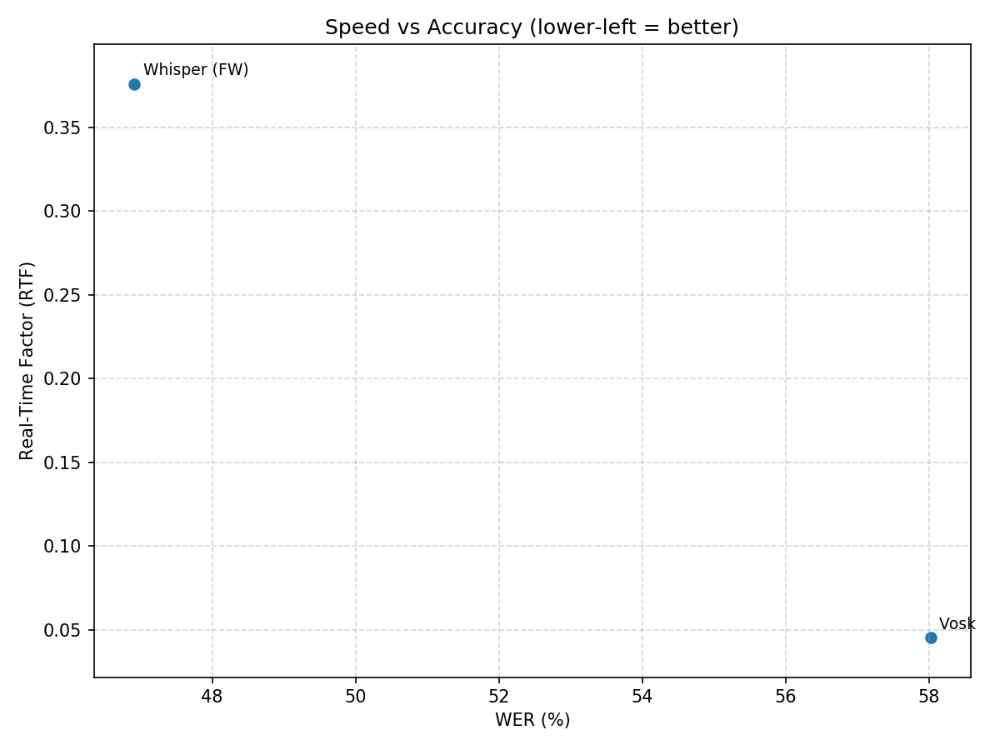
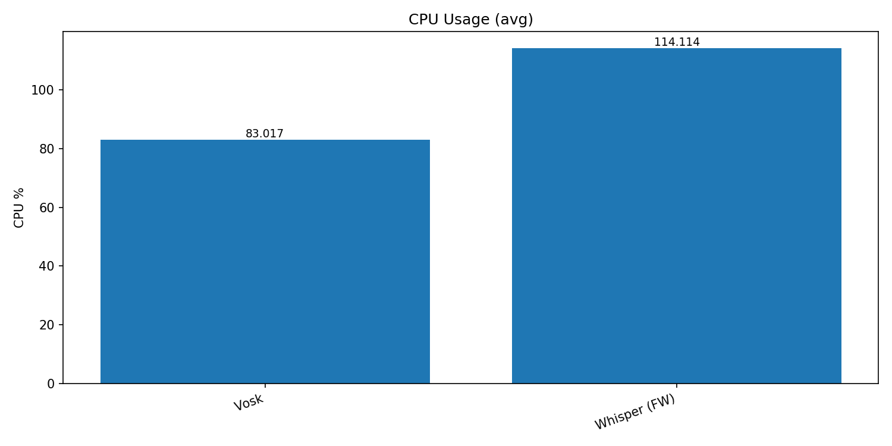
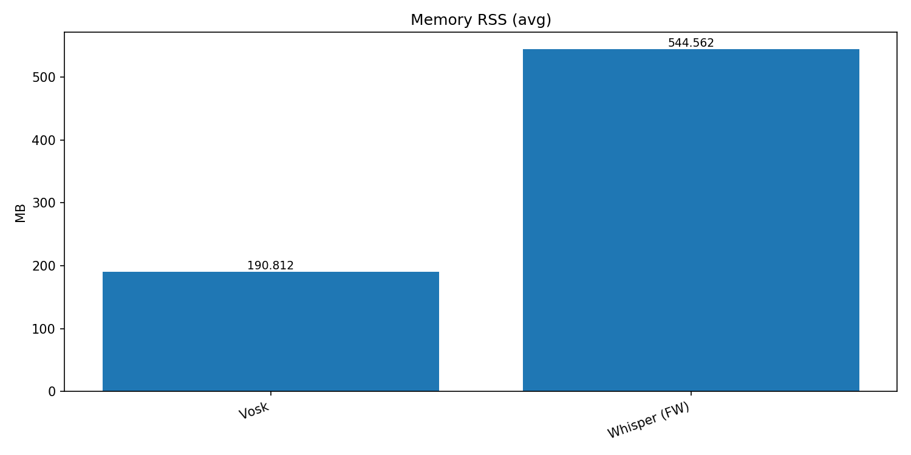

# Vosk vs Whisper (faster-whisper)

This report compares the latest Vosk and faster-whisper runs.

## Metrics

### Vosk
- Text: Vosk
- WER: 0.580  CER: 0.462
- RTF: 0.045  Wall: 1.21s  Audio: 26.50s
- CPU avg/max: 83.0%/104.6%  RSS avg/max: 191/191 MB

### Whisper (FW)
- Text: Whisper (FW)
- WER: 0.469  CER: 0.326
- RTF: 0.376  Wall: 9.96s  Audio: 26.50s
- CPU avg/max: 114.1%/776.7%  RSS avg/max: 545/606 MB

## Charts

